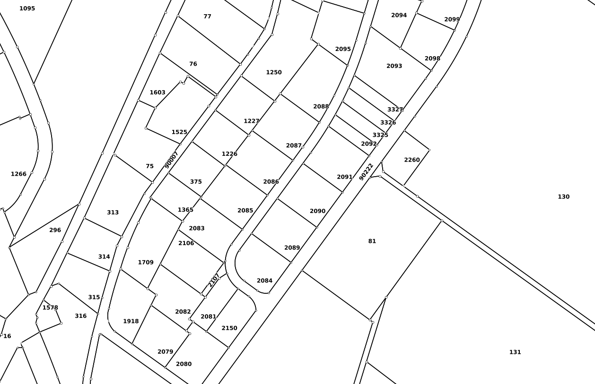

# build-your-own-gis-client

## add layer


Die Hinzufügen eines Kartenlayers geschieht in drei Schritten.

## Layer suchen 
Im Suchservice [https://geo.so.ch/api/search/v2/?searchtext=fixp&filter=foreground](https://geo.so.ch/api/search/v2/?searchtext=fixp&filter=foreground) kann mittels Volltextsuch nach allen vorhandenen Kartenlayern gesucht werden. Der Suchtext muss im Parameter `searchtext` stehen, z.B. `fixp` für "Fixpunkte". Es sind der technische Namen, der menschenlesbare Namen und die Kurzbeschreibung des Kartenlayers indexiert. So findet z.B. "Parzelle" auch den Kartenlayer `Grundstücke (amtliche Vermessung)` (Parzelle als Synonym für Grundstück, beschrieben in der Kurzbeschreibung). Der Rückgabewerte ist JSON.

Request: [https://geo.so.ch/api/search/v2/?searchtext=fixp&filter=foreground](https://geo.so.ch/api/search/v2/?searchtext=fixp&filter=foreground)

Response: 
```
{
  "results": [
    {
      "dataproduct": {
        "display": "Amtliche Vermessung",
        "stacktype": "foreground",
        "dataproduct_id": "ch.so.agi.av.amtliche_vermessung",
        "dset_info": true,
        "sublayers": [
          {
            "display": "Fixpunkte (amtliche Vermessung)",
            "dataproduct_id": "ch.so.agi.av.fixpunkte",
            "dset_info": true,
            "type": "datasetview"
          },
          {
            "display": "Hoheitsgrenzen (amtliche Vermessung)",
            "dataproduct_id": "ch.so.agi.hoheitsgrenzen",
            "dset_info": true,
            "type": "facadelayer"
          },
          {
            "display": "Nomenklatur - Flurnamen und Geländenamen (amtliche Vermessung)",
            "dataproduct_id": "ch.so.agi.av.nomenklatur",
            "dset_info": true,
            "type": "facadelayer"
          },
          {
            "display": "Grundstücke (amtliche Vermessung)",
            "dataproduct_id": "ch.so.agi.av.grundstuecke",
            "dset_info": true,
            "type": "facadelayer"
          },
          {
            "display": "Gebäudeadressen (amtliche Vermessung)",
            "dataproduct_id": "ch.so.agi.av.gebaeudeadressen",
            "dset_info": true,
            "type": "facadelayer"
          },
          {
            "display": "Rohrleitungen (amtliche Vermessung)",
            "dataproduct_id": "ch.so.agi.av.rohrleitungen",
            "dset_info": true,
            "type": "datasetview"
          },
          {
            "display": "Bodenbedeckung und Einzelobjekte (amtliche Vermessung)",
            "dataproduct_id": "ch.so.agi.av.bodenbedeckung_einzelobjekte",
            "dset_info": true,
            "type": "facadelayer"
          }
        ],
        "type": "layergroup"
      }
    }
  ],
  "result_counts": []
}
```

Das `results`-Array beinhaltet 0 bis * `dataproduct`-Objekte. Ein `dataproduct`-Objekt beschreibt entweder eine _Layergruppe_ oder einen _Einzellayer_ (`facacelayer` oder `datasetview`). Eine Layergruppe beinhaltet im Attribut `sublayers` mögliche weitere Layergruppen oder Einzellayer. Sowohl in einer Layergruppe wie auch in einem Einzellayer ist das Attribut `dataproduct_id` der kantonsweit eindeutige Identifikator für die Kartenebene und für die weiteren Requests (siehe folgende Kapitel) relevant. 

Request, Beispiel mit Einzellayer: [https://geo.so.ch/api/search/v2/?searchtext=controll&filter=foreground](https://geo.so.ch/api/search/v2/?searchtext=controll&filter=foreground)

Response:

```
{
  "results": [
    {
      "dataproduct": {
        "stacktype": "foreground",
        "type": "datasetview",
        "display": "Controlling AV-Mutationen",
        "dataproduct_id": "ch.so.agi.av.gb2av.controlling_mutationen",
        "dset_info": true
      }
    },
    {
      "dataproduct": {
        "stacktype": "foreground",
        "type": "datasetview",
        "display": "Controlling AVGBS-Vollzugsmeldungen ",
        "dataproduct_id": "ch.so.agi.av.gb2av.controlling_vollzugsmeldungen",
        "dset_info": true
      }
    },
    {
      "dataproduct": {
        "stacktype": "foreground",
        "type": "datasetview",
        "display": "Controlling AV-Validierung",
        "dataproduct_id": "ch.so.agi.av.validierung",
        "dset_info": true
      }
    }
  ],
  "result_counts": []
}
```

Der Filterparameter kann erweitert werden, falls der Suchdienst auch dazu verwendet werden soll, um Adressen, Gemeinden, Flurnamen etc. zu finden:

Request, Suche nach "Rötistrasse 4: [https://geo.so.ch/api/search/v2/?searchtext=r%C3%B6tistr+4+solo&filter=foreground,ch.so.agi.gemeindegrenzen,ch.so.agi.av.gebaeudeadressen.gebaeudeeingaenge,ch.so.agi.av.bodenbedeckung,ch.so.agi.av.grundstuecke.projektierte,ch.so.agi.av.grundstuecke.rechtskraeftig,ch.so.agi.av.nomenklatur.flurnamen,ch.so.agi.av.nomenklatur.gelaendenamen](https://geo.so.ch/api/search/v2/?searchtext=r%C3%B6tistr+4+solo&filter=foreground,ch.so.agi.gemeindegrenzen,ch.so.agi.av.gebaeudeadressen.gebaeudeeingaenge,ch.so.agi.av.bodenbedeckung,ch.so.agi.av.grundstuecke.projektierte,ch.so.agi.av.grundstuecke.rechtskraeftig,ch.so.agi.av.nomenklatur.flurnamen,ch.so.agi.av.nomenklatur.gelaendenamen)

Response:
```
{
  "results": [
    {
      "feature": {
        "id_field_type": false,
        "display": "Rötistrasse 4, 4500 Solothurn (Adresse)",
        "dataproduct_id": "ch.so.agi.av.gebaeudeadressen.gebaeudeeingaenge",
        "feature_id": 589682122,
        "bbox": [
          2607888,
          1228249,
          2607888,
          1228249
        ],
        "id_field_name": "t_id"
      }
    },
    {
      "feature": {
        "id_field_type": false,
        "display": "Rötistrasse 24, 4500 Solothurn (Adresse)",
        "dataproduct_id": "ch.so.agi.av.gebaeudeadressen.gebaeudeeingaenge",
        "feature_id": 589682121,
        "bbox": [
          2607832,
          1228645,
          2607832,
          1228645
        ],
        "id_field_name": "t_id"
      }
    },
    {
      "feature": {
        "id_field_type": false,
        "display": "Rötistrasse 6, 4500 Solothurn (Adresse)",
        "dataproduct_id": "ch.so.agi.av.gebaeudeadressen.gebaeudeeingaenge",
        "feature_id": 589682129,
        "bbox": [
          2607879,
          1228297,
          2607879,
          1228297
        ],
        "id_field_name": "t_id"
      }
    },
    {
      "feature": {
        "id_field_type": false,
        "display": "Rötistrasse 5, 4500 Solothurn (Adresse)",
        "dataproduct_id": "ch.so.agi.av.gebaeudeadressen.gebaeudeeingaenge",
        "feature_id": 589682123,
        "bbox": [
          2607845,
          1228279,
          2607845,
          1228279
        ],
        "id_field_name": "t_id"
      }
    },
    {
      "feature": {
        "id_field_type": false,
        "display": "Rötistrasse 37, 4500 Solothurn (Adresse)",
        "dataproduct_id": "ch.so.agi.av.gebaeudeadressen.gebaeudeeingaenge",
        "feature_id": 589682127,
        "bbox": [
          2607785,
          1228609,
          2607785,
          1228609
        ],
        "id_field_name": "t_id"
      }
    },
    {
      "feature": {
        "id_field_type": false,
        "display": "Rötistrasse 3, 4500 Solothurn (Adresse)",
        "dataproduct_id": "ch.so.agi.av.gebaeudeadressen.gebaeudeeingaenge",
        "feature_id": 589682126,
        "bbox": [
          2607848,
          1228262,
          2607848,
          1228262
        ],
        "id_field_name": "t_id"
      }
    },
    {
      "feature": {
        "id_field_type": false,
        "display": "Rötistrasse 25, 4500 Solothurn (Adresse)",
        "dataproduct_id": "ch.so.agi.av.gebaeudeadressen.gebaeudeeingaenge",
        "feature_id": 589682130,
        "bbox": [
          2607778,
          1228682,
          2607778,
          1228682
        ],
        "id_field_name": "t_id"
      }
    },
    {
      "feature": {
        "id_field_type": false,
        "display": "Rötistrasse 22a, 4500 Solothurn (Adresse)",
        "dataproduct_id": "ch.so.agi.av.gebaeudeadressen.gebaeudeeingaenge",
        "feature_id": 589682124,
        "bbox": [
          2607876,
          1228637,
          2607876,
          1228637
        ],
        "id_field_name": "t_id"
      }
    },
    {
      "feature": {
        "id_field_type": false,
        "display": "Rötistrasse 22, 4500 Solothurn (Adresse)",
        "dataproduct_id": "ch.so.agi.av.gebaeudeadressen.gebaeudeeingaenge",
        "feature_id": 589682125,
        "bbox": [
          2607844,
          1228625,
          2607844,
          1228625
        ],
        "id_field_name": "t_id"
      }
    },
    {
      "feature": {
        "id_field_type": false,
        "display": "Rötistrasse 17, 4500 Solothurn (Adresse)",
        "dataproduct_id": "ch.so.agi.av.gebaeudeadressen.gebaeudeeingaenge",
        "feature_id": 589682128,
        "bbox": [
          2607796,
          1228532,
          2607796,
          1228532
        ],
        "id_field_name": "t_id"
      }
    },
    {
      "feature": {
        "id_field_type": false,
        "display": "Rötistrasse 1, 4500 Solothurn (Adresse)",
        "dataproduct_id": "ch.so.agi.av.gebaeudeadressen.gebaeudeeingaenge",
        "feature_id": 589682131,
        "bbox": [
          2607856,
          1228210,
          2607856,
          1228210
        ],
        "id_field_name": "t_id"
      }
    }
  ],
  "result_counts": [
    {
      "filterword": "Adresse",
      "dataproduct_id": "ch.so.agi.av.gebaeudeadressen.gebaeudeeingaenge",
      "count": 11
    }
  ]
}
```

## Metainformation / Zusatzinformationen 

Der eindeutige Kartenlayer-Identifikator `dataproduct_id` würde reichen, um das Kartenbild bereits beim dazu vorgesehen Service (Web Map Servcie, siehe folgendes Kapitel) zu requesten. Der Dataproduct Service liefert einige sinnvolle Zuatzinformationen zum Kartenlayer:
 
 - Kurzbeschreibung
 - Koordinatensystem
 - Ausdehnung
 - Sichtbarkeit: Ist der Layer standardmässig eingeschaltet im Web GIS Client (geo.so.ch/map)?
 - Opazität: Die Startopazität des Layers im Web GIS Client

Am nutzbarsten scheint der Opazitätswert in einem GIS Client damit man z.B. flächendeckende Kartenlayer nicht komplett den Hintergrund überdecken. Dieser Wert muss beim nachfolgenden WMS-Request mitgegeben werden.

Request: [https://geo.so.ch/api/dataproduct/v1/weblayers?filter=ch.so.agi.av.amtliche_vermessung](https://geo.so.ch/api/dataproduct/v1/weblayers?filter=ch.so.agi.av.amtliche_vermessung)

Response:
```
{
  "ch.so.agi.av.amtliche_vermessung": [
    {
      "abstract": "Die amtliche Vermessung hält als Bestandteil des Grundbuches die genauen Grenzverläufe der Grundstücke fest und schafft damit die Basis zur Sicherung des Grundeigentums. Nebst den aktuellen Grundstücksgrenzen sind in den Daten der amtlichen Vermessung auch weitere Objekte wie Gebäude, Strassen, Gebäudeadressen usw. abgebildet.",
      "title": "Amtliche Vermessung",
      "name": "ch.so.agi.av.amtliche_vermessung",
      "visibility": true,
      "displayField": "",
      "opacity": 255,
      "bbox": {
        "crs": "EPSG:2056",
        "bounds": [
          2590983.475,
          1212806.115625,
          2646267.025,
          1262755.009375
        ]
      },
      "sublayers": [
        {
          "abstract": "Fixpunkte sind dauerhaft mit einem Stein oder einem Bolzen (zum Teil unter Schacht) versicherte Punkte mit bekannten Koordinaten und/oder einer bekannten Höhe. \r\nDie Fixpunkte bilden die Grundlage aller Geodaten wie z.B. für die amtliche Vermessung oder für den Leitungskataster.  Es werden generell zwei Punktarten unterschieden: die Lagefixpunkte (LFP) und die Höhenfixpunkte (HFP).  Weitere Information siehe unter <a href=\"https://www.so.ch/verwaltung/bau-und-justizdepartement/amt-fuer-geoinformation/amtliche-vermessung/fixpunkte/\"> https://www.so.ch/verwaltung/bau-und-justizdepartement/amt-fuer-geoinformation/amtliche-vermessung/fixpunkte </a>",
          "title": "Fixpunkte (amtliche Vermessung)",
          "name": "ch.so.agi.av.fixpunkte",
          "visibility": false,
          "displayField": "",
          "opacity": 255,
          "bbox": {
            "crs": "EPSG:2056",
            "bounds": [
              2590983.475,
              1212806.115625,
              2646267.025,
              1262755.009375
            ]
          },
          "queryable": true
        },
        {
          "abstract": "Als Hoheitsgrenzen werden die Landesgrenzen, Kantonsgrenzen und die Grenzen der politischen Gemeinden bezeichnet.\r\nDie Hoheitsgrenzen liegen auf Grundstücksgrenzen. Sie sind Bestandteil der amtlichen Vermessung.\r\nDer Kanton führt für besondere Grenzzeichen an der Kantonsgrenze ein Inventar.  Weitere Informationen unter <a href=\"https://www.so.ch/verwaltung/bau-und-justizdepartement/amt-fuer-geoinformation/amtliche-vermessung/hoheitsgrenzen/\"> https://www.so.ch/verwaltung/bau-und-justizdepartement/amt-fuer-geoinformation/amtliche-vermessung/hoheitsgrenzen </a>",
          "title": "Hoheitsgrenzen (amtliche Vermessung)",
          "name": "ch.so.agi.hoheitsgrenzen",
          "visibility": false,
          "displayField": "",
          "opacity": 255,
          "bbox": {
            "crs": "EPSG:2056",
            "bounds": [
              2590983.475,
              1212806.115625,
              2646267.025,
              1262755.009375
            ]
          },
          "searchterms": [
            "ch.so.agi.bezirksgrenzen",
            "ch.so.agi.gemeindegrenzen"
          ],
          "queryable": true
        },
        {
          "abstract": "Ein Flurname ist eine namentliche Bezeichnung eines kleinräumigen Geländeabschnittes z.B. für Wiesen, Berghänge, Waldabschnitte usw. Die Gebiete mit den Flurnamen sind flächendeckend über den Kanton erfasst.  \r\nGeländepunkte mit einer Bezeichnung, welche nicht geometrisch abgegrenzt werden können (wie z.B. Berggipfel, Gräben und Täler), werden mit einem Geländenamen beschriftet. \r\nDie Schreibweise der Nomenklatur erfolgt in der ortsüblichen Sprechform und wird durch die Flurnamenkommission festgelegt. Weitere Informationen unter <a href=\"https://www.so.ch/verwaltung/bau-und-justizdepartement/amt-fuer-geoinformation/amtliche-vermessung/nomenklatur/\"> https://www.so.ch/verwaltung/bau-und-justizdepartement/amt-fuer-geoinformation/amtliche-vermessung/nomenklatur </a>",
          "title": "Nomenklatur - Flurnamen und Geländenamen (amtliche Vermessung)",
          "name": "ch.so.agi.av.nomenklatur",
          "visibility": false,
          "displayField": "",
          "opacity": 255,
          "bbox": {
            "crs": "EPSG:2056",
            "bounds": [
              2590983.475,
              1212806.115625,
              2646267.025,
              1262755.009375
            ]
          },
          "searchterms": [
            "ch.so.agi.av.nomenklatur.flurnamen",
            "ch.so.agi.av.nomenklatur.gelaendenamen"
          ],
          "queryable": true
        },
        {
          "abstract": "Die Kartenebene Grundstücke enthält die rechtsgültigen und projektierten Liegenschaften sowie der selbständigen und dauernden Rechte (SDR) wie z.B. Baurecht und Bergwerke. <br>\r\n\r\nDie projektierten und rechtsgültigen Grundstücke sind die Grundlage für die Führung des Grundbuches und dokumentieren das Eigentum an Grund und Boden. <br>\r\nDie Grundstücke werden mit Grenzzeichen (<a href=\"https://www.so.ch/verwaltung/bau-und-justizdepartement/amt-fuer-geoinformation/amtliche-vermessung/grenzzeichen/\">Bolzen oder Stein </a>) und damit verbundenen Grundstücksgrenzen aus Geraden und Kreisbogen bestimmt. Die Grundstücksnummer ist pro Grundbuchkreis eindeutig.  Die Eidgenössische Grundstücksidentifikation (E-GRID) ist eine eindeutige Nummer über die ganze Schweiz für Grundstücke.",
          "title": "Grundstücke (amtliche Vermessung)",
          "name": "ch.so.agi.av.grundstuecke",
          "visibility": true,
          "displayField": "",
          "opacity": 255,
          "bbox": {
            "crs": "EPSG:2056",
            "bounds": [
              2590983.475,
              1212806.115625,
              2646267.025,
              1262755.009375
            ]
          },
          "searchterms": [
            "ch.so.agi.av.grundstuecke.projektierte",
            "ch.so.agi.av.grundstuecke.rechtskraeftig"
          ],
          "queryable": true
        },
        {
          "abstract": "Die Kartenebene Gebäudeadresse zeigt die Hausnummer eines Gebäudes und die Zuweisung zu der Lokalisation (Strasse, Platz, benanntes Gebiet). \r\nEine Gebäudeadresse setzt sich aus der Lokalisation (Strasse, Platz, benanntes Gebiet), Hausnummer, Postleitzahl und Ortschaft zusammen.  Weitere Informationen unter <a href=\"https://www.so.ch/verwaltung/bau-und-justizdepartement/amt-fuer-geoinformation/amtliche-vermessung/gebaeudeadressen/\"> https://www.so.ch/verwaltung/bau-und-justizdepartement/amt-fuer-geoinformation/amtliche-vermessung/gebaeudeadressen </a>",
          "title": "Gebäudeadressen (amtliche Vermessung)",
          "name": "ch.so.agi.av.gebaeudeadressen",
          "visibility": false,
          "displayField": "",
          "opacity": 255,
          "bbox": {
            "crs": "EPSG:2056",
            "bounds": [
              2590983.475,
              1212806.115625,
              2646267.025,
              1262755.009375
            ]
          },
          "searchterms": [
            "ch.so.agi.av.gebaeudeadressen.gebaeudeeingaenge"
          ],
          "queryable": true
        },
        {
          "abstract": "Kartenebene aus den Daten der amtlichen Vermessung, welche die Öl- und Gasleitungen (z.B. GVM, Transitgas) sowie andere Rohrleitungen enthält, die dem Gesetz vom 4. Oktober 1963 über Rohrleitungsanlagen unterliegen.",
          "title": "Rohrleitungen (amtliche Vermessung)",
          "name": "ch.so.agi.av.rohrleitungen",
          "visibility": false,
          "displayField": "",
          "opacity": 255,
          "bbox": {
            "crs": "EPSG:2056",
            "bounds": [
              2590983.475,
              1212806.115625,
              2646267.025,
              1262755.009375
            ]
          },
          "queryable": true
        },
        {
          "abstract": "Die Kartenebene Bodenbedeckung und Einzelobjekte ist ein Bestandteil des Grunddatensatzes nach <a href=\"https://www.admin.ch/opc/de/classified-compilation/19920299/index.html#a6\">Artikel 6 VAV </a>. Das Thema Bodenbedeckung und Einzelobjekte umfasst Objekte wie z.B. die Gebäude, Wald, Gewässer und Strassen.",
          "title": "Bodenbedeckung und Einzelobjekte (amtliche Vermessung)",
          "name": "ch.so.agi.av.bodenbedeckung_einzelobjekte",
          "visibility": false,
          "displayField": "",
          "opacity": 255,
          "bbox": {
            "crs": "EPSG:2056",
            "bounds": [
              2590983.475,
              1212806.115625,
              2646267.025,
              1262755.009375
            ]
          },
          "searchterms": [
            "ch.so.agi.av.bodenbedeckung"
          ],
          "queryable": true
        }
      ],
      "searchterms": [
        "ch.so.agi.bezirksgrenzen",
        "ch.so.agi.gemeindegrenzen",
        "ch.so.agi.av.nomenklatur.flurnamen",
        "ch.so.agi.av.nomenklatur.gelaendenamen",
        "ch.so.agi.av.grundstuecke.projektierte",
        "ch.so.agi.av.grundstuecke.rechtskraeftig",
        "ch.so.agi.av.gebaeudeadressen.gebaeudeeingaenge",
        "ch.so.agi.av.bodenbedeckung"
      ],
      "queryable": true
    }
  ]
}
```

## Kartenbild
Das eigentliche Kartenbild liefert der Web Map Service (WMS) aufgrund eines Get-Requests aus. WMS ist ein OGC Standard (im Gegensatz zu den beiden oberen Services).

Request: [https://geo.so.ch/api/wms?SERVICE=WMS&VERSION=1.3.0&REQUEST=GetMap&FORMAT=image%2Fpng&TRANSPARENT=true&LAYERS=ch.so.agi.av.grundstuecke&STYLES=&SRS=EPSG%3A2056&CRS=EPSG%3A2056&TILED=false&DPI=96&OPACITIES=255&t=419&WIDTH=1258&HEIGHT=813&BBOX=2608915.2270833333%2C1226214.5010416666%2C2609248.0729166665%2C1226429.6072916668](https://geo.so.ch/api/wms?SERVICE=WMS&VERSION=1.3.0&REQUEST=GetMap&FORMAT=image%2Fpng&TRANSPARENT=true&LAYERS=ch.so.agi.av.grundstuecke&STYLES=&SRS=EPSG%3A2056&CRS=EPSG%3A2056&TILED=false&DPI=96&OPACITIES=255&t=419&WIDTH=1258&HEIGHT=813&BBOX=2608915.2270833333%2C1226214.5010416666%2C2609248.0729166665%2C1226429.6072916668)

Der `LAYERS`-Parameter entspricht der `dataproduct_id`. `WIDTH` und `HEIGHT` der Grösser des Bildes in Pixel. `BBOX` ist die Ausdehnung des Kartenbiles in Weltkoordinaten (Schweizer Koordinatensystem). Das Ratio zwischen WIDTH/HEIGHT in Pixel und der Ost-West-Ausdehung und Nord-Süd-Ausdehnung muss identisch sein. Ansonsten wird das Kartenbild verzerrt dargestellt. 

Response:




## Objektabfrage
Mit dem GetFeatureInfo-Request können Informationen zu einzeln Objekte abgefragt werden:

Request: [https://geo.so.ch/api/v1/featureinfo/somap?service=WMS&version=1.3.0&request=GetFeatureInfo&id=default1607000094738&layers=ch.so.agi.av.grundstuecke&query_layers=ch.so.agi.av.grundstuecke&x=51&y=51&i=51&j=51&height=101&width=101&srs=EPSG:2056&crs=EPSG:2056&bbox=2609046.5751383463,1226270.9513427734,2609073.2980550127,1226297.6742594403&info_format=text%2Fxml&with_geometry=true&with_maptip=false&feature_count=40&FI_POINT_TOLERANCE=16&FI_LINE_TOLERANCE=8&FI_POLYGON_TOLERANCE=4](https://geo.so.ch/api/v1/featureinfo/somap?service=WMS&version=1.3.0&request=GetFeatureInfo&id=default1607000094738&layers=ch.so.agi.av.grundstuecke&query_layers=ch.so.agi.av.grundstuecke&x=51&y=51&i=51&j=51&height=101&width=101&srs=EPSG:2056&crs=EPSG:2056&bbox=2609046.5751383463,1226270.9513427734,2609073.2980550127,1226297.6742594403&info_format=text%2Fxml&with_geometry=true&with_maptip=false&feature_count=40&FI_POINT_TOLERANCE=16&FI_LINE_TOLERANCE=8&FI_POLYGON_TOLERANCE=4)

`bbox`, `x`, `y`, `height`, `width` können, startend vom Klickpunkt in die Karte, berechnet werden. Warum 50px resp. 100px ist mir momentan nicht ganz klar. Wird sicher in der WMS-Spezifikation erläutert sein.

Beispielberechnung: [https://github.com/edigonzales/gwt-wgc-embedded/blob/master/src/main/java/ch/so/agi/wgc/client/Popup.java#L73](https://github.com/edigonzales/gwt-wgc-embedded/blob/master/src/main/java/ch/so/agi/wgc/client/Popup.java#L73)

Response:

```

<GetFeatureInfoResponse>
    <Layer name="Hoheitsgrenzpunkte (Grundbuchplan schwarz-weiss)" layername="ch.so.agi.grundbuchplan_sw.hoheitsgrenzpunkte"
        layerinfo="ch.so.agi.av.grundstuecke"
        
        ></Layer>
    <Layer name="Grenzpunkte (Grundstücke)" layername="ch.so.agi.av.grundstuecke.grenzpunkte"
        layerinfo="ch.so.agi.av.grundstuecke"
        
        ></Layer>
    <Layer name="projektierte Liegenschaften (Grundstücke)" layername="ch.so.agi.av.grundstuecke.projektierte"
        layerinfo="ch.so.agi.av.grundstuecke"
        
        ></Layer>
    <Layer name="Grundstücke" layername="ch.so.agi.av.grundstuecke.rechtskraeftig"
        layerinfo="ch.so.agi.av.grundstuecke"
        featurereport="grundstuecksbeschrieb.pdf"
        >
        <Feature id="590490906">
            <HtmlContent inline="1">&lt;!DOCTYPE html&gt;
&lt;html lang=&quot;de&quot;&gt; 
&lt;table class=&quot;attribute-list&quot;&gt;
   &lt;tr&gt;
    &lt;td class=&quot;identify-attr-title wrap&quot;&gt;&lt;i&gt;Grundstücksnummer:&lt;/i&gt;&lt;/td&gt;
    &lt;td class=&quot;identify-attr-value wrap&quot;&gt;2084 &lt;/td&gt;
  &lt;/tr&gt;
  &lt;tr&gt;
    &lt;td class=&quot;identify-attr-title wrap&quot;&gt;&lt;i&gt;Art:&lt;/i&gt;&lt;/td&gt;
    &lt;td class=&quot;identify-attr-value wrap&quot;&gt;Liegenschaft &lt;/td&gt;
  &lt;/tr&gt;
  &lt;tr&gt;
    &lt;td class=&quot;identify-attr-title wrap&quot;&gt;&lt;i&gt;Fläche [m2]:&lt;/i&gt;&lt;/td&gt;
    &lt;td class=&quot;identify-attr-value wrap&quot;&gt;618 &lt;/td&gt;
  &lt;/tr&gt;
  &lt;tr&gt;
    &lt;td class=&quot;identify-attr-title wrap&quot;&gt;&lt;i&gt;EGRID:&lt;/i&gt;&lt;/td&gt;
    &lt;td class=&quot;identify-attr-value wrap&quot;&gt;CH727994320611 &lt;/td&gt;
  &lt;/tr&gt;
  &lt;tr&gt;
    &lt;td class=&quot;identify-attr-title wrap&quot;&gt;&lt;i&gt;Link zum Intercapi:&lt;/i&gt;&lt;/td&gt;
    &lt;td class=&quot;identify-attr-value wrap&quot;&gt;&lt;a href=&quot;https://intercapi.so.ch/intercapi/faces?type=grundstueck_grundbuch_auszug&amp;egrid=CH727994320611&quot; target=&quot;_blank&quot;&gt;https://intercapi.so.ch&lt;/a&gt;&lt;/td&gt; 
  &lt;/tr&gt;
&lt;/table&gt;
&lt;/body&gt;
&lt;/html&gt;</HtmlContent>
            
            <BoundingBox CRS="EPSG:2056"
                minx="2609046.6755" miny="1226265.3198"
                maxx="2609078.051" maxy="1226298.802"
            />
            
            <Attribute name="geometry" value="Polygon ((2609049.025 1226289.421, 2609055.907 1226298.802, 2609078.051 1226282.619, 2609065.599 1226265.511, 2609065.3606 1226265.4617, 2609065.1209 1226265.4197, 2609064.88 1226265.385, 2609064.6381 1226265.3576, 2609064.3955 1226265.3376, 2609064.1525 1226265.325, 2609063.9091 1226265.3198, 2609063.6657 1226265.322, 2609063.4225 1226265.3316, 2609063.1797 1226265.3486, 2609062.9375 1226265.3729, 2609062.6962 1226265.4046, 2609062.456 1226265.4437, 2609062.217 1226265.49, 2609061.9795 1226265.5436, 2609061.7438 1226265.6043, 2609061.5101 1226265.6723, 2609061.2785 1226265.7472, 2609061.0493 1226265.8292, 2609060.8227 1226265.9182, 2609060.5989 1226266.0139, 2609060.3781 1226266.1165, 2609060.1605 1226266.2257, 2609059.9464 1226266.3415, 2609059.7359 1226266.4637, 2609059.5292 1226266.5923, 2609059.3265 1226266.7271, 2609059.128 1226266.868, 2609051.652 1226272.349, 2609051.4056 1226272.5357, 2609051.1639 1226272.7286, 2609050.9272 1226272.9275, 2609050.6956 1226273.1323, 2609050.4693 1226273.3429, 2609050.2483 1226273.5591, 2609050.0329 1226273.7808, 2609049.8231 1226274.0079, 2609049.6191 1226274.2403, 2609049.421 1226274.4777, 2609049.229 1226274.72, 2609049.0432 1226274.9671, 2609048.8637 1226275.2188, 2609048.6906 1226275.4749, 2609048.524 1226275.7354, 2609048.364 1226275.9999, 2609048.2107 1226276.2684, 2609048.0643 1226276.5407, 2609047.9248 1226276.8166, 2609047.7923 1226277.096, 2609047.6669 1226277.3786, 2609047.5486 1226277.6642, 2609047.4376 1226277.9528, 2609047.3339 1226278.2441, 2609047.2376 1226278.5378, 2609047.1488 1226278.834, 2609047.0674 1226279.1322, 2609046.9936 1226279.4325, 2609046.9274 1226279.7345, 2609046.8689 1226280.038, 2609046.818 1226280.343, 2609046.7748 1226280.6492, 2609046.7394 1226280.9563, 2609046.7117 1226281.2643, 2609046.6918 1226281.5728, 2609046.6797 1226281.8817, 2609046.6755 1226282.1909, 2609046.679 1226282.5001, 2609046.6903 1226282.8091, 2609046.7094 1226283.1176, 2609046.7363 1226283.4257, 2609046.7709 1226283.7329, 2609046.8133 1226284.0392, 2609046.8634 1226284.3443, 2609046.9212 1226284.648, 2609046.9866 1226284.9502, 2609047.0597 1226285.2506, 2609047.1403 1226285.5491, 2609047.2284 1226285.8455, 2609047.3239 1226286.1395, 2609047.4269 1226286.4311, 2609047.5371 1226286.7199, 2609047.6547 1226287.0059, 2609047.7794 1226287.2888, 2609047.9112 1226287.5685, 2609048.05 1226287.8448, 2609048.1957 1226288.1175, 2609048.3483 1226288.3864, 2609048.5076 1226288.6514, 2609048.6736 1226288.9122, 2609048.8461 1226289.1688, 2609049.025 1226289.421))"
                type="derived" />
            
            <Attribute name="nummer" value="2084" />
            <Attribute name="art_txt" value="Liegenschaft" />
            <Attribute name="flaechenmass" value="618" />
            <Attribute name="egrid" value="CH727994320611" />
            <Attribute name="bfs_nr" value="2513" />
        </Feature>
        </Layer></GetFeatureInfoResponse>
```

Die Geometrie kann zum Highlighten im GIS Client verwendet werden.


## background layer
Für die Hintergrundkarte kann auch ein WMS-Layer verwendet werden:
- ch.so.agi.hintergrundkarte_sw
- ch.so.agi.hintergrundkarte_farbig
- ch.so.agi.hintergrundkarte_ortho

Aus Performance- und Lastgründen sind die vorgecachten WMTS-Pendants zu vorzuziehen. WMTS ist ebenfalls ein OGC-Standard. Ähnlich wie WMS liefert WMTS Bilder aus. Diese sind aber in kleine Kacheln aufgeteilt, die in einem Cache vorliegen und somit nicht bei jedem Request neu gerendert werden müssen.

Siehe dazu: [https://so.ch/verwaltung/bau-und-justizdepartement/amt-fuer-geoinformation/geoportal/geodienste/wmts-web-map-tile-service/](https://so.ch/verwaltung/bau-und-justizdepartement/amt-fuer-geoinformation/geoportal/geodienste/wmts-web-map-tile-service/)